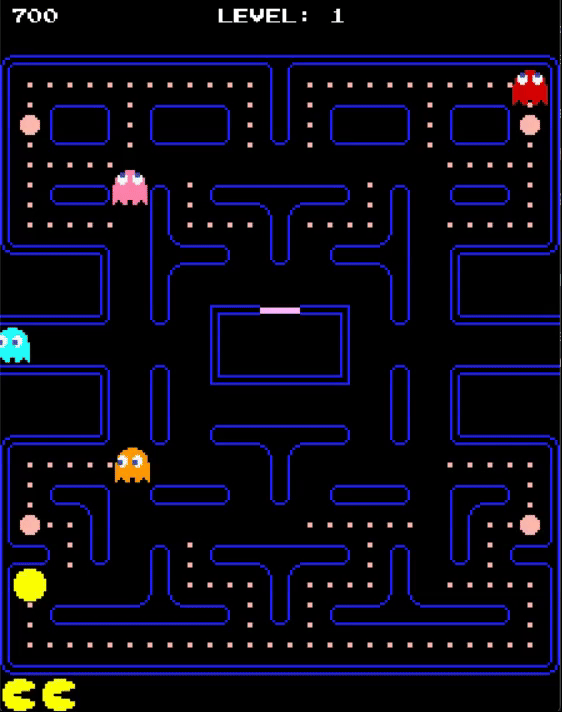

# Pac-Man Game

This is a simplified implementation of the classic Pac-Man game.  
The player controls Pac-Man navigating through a maze while avoiding ghosts.  
Each ghost has a unique targeting algorithm inspired by the original Pac-Man game, creating a dynamic and strategic gameplay experience.

---

## Features
- Classic Pac-Man gameplay mechanics
- 4 unique ghost AI behaviors
- Level progression system
- Sound effects and animations
- Fruit bonus system


## Controls
- **Arrow Keys**: Move Pac-Man (Up, Down, Left, Right)
- **ESC**: Pause/Menu

---

## Ghost Movement Algorithm

Each ghost has a different targeting behavior based on Pac-Man's position and direction...
### Blinky (Red Ghost)
- Directly chases Pac-Man by targeting his **current position**.
- Aggressive and constantly pursues the player.


---

### Pinky (Pink Ghost)
- Targets **four tiles ahead** of Pac-Man in the direction he is currently moving.
- Attempts to **ambush Pac-Man** by predicting his future position.
- Does not target Pac-Man directly, but aims to cut him off.


---

### Inky (Blue Ghost)
- Combines Pac-Man and Blinky’s positions:
  - First calculates a tile **two steps ahead of Pac-Man** (based on Pac-Man’s current direction).
  - Then forms a vector from **Blinky’s position** to that tile, doubles it, and uses the result as the target.
- This makes Inky's movement **unpredictable and reactive**.


---

### Clyde (Orange Ghost)
- Behavior switches based on distance to Pac-Man:
  - If **far** from Pac-Man (distance squared ≥ 64 tiles), behaves like Blinky and **chases Pac-Man**.
  - If **close**, retreats to a predefined **scatter corner**.
- This causes Clyde to **randomly alternate** between chasing and fleeing.


---

## Ghost States

Each ghost can be in one of several behavioral states during the game:

- **WAIT**  
  - Ghost remains inside the ghost house and does not move in the maze.  
  - Used at the beginning of the game or after respawning.

- **EXIT**  
  - Ghost exits the ghost house and enters the maze.

- **CHASE**  
  - Ghosts target Pac-Man using their **custom targeting algorithm** (described above).  
  - This mode is **aggressive** and keeps pressure on the player.

- **SCATTER**  
  - Ghosts stop chasing Pac-Man and head toward their **own corner of the maze**.  
  - This mode is **temporary**, allowing players a brief relief and helping to **mix the gameplay flow**.

```cpp
enum GhostState {
    WAIT,
    EXIT,
    CHASE,
    SCATTER,
    FRIGHTENED,
    EATEN
};
```
---

## Ghost Modes Explained

### Scatter Mode
- Each ghost targets a fixed corner of the maze:
  - **Blinky** → Top-right corner  
  - **Pinky** → Top-left corner  
  - **Inky** → Bottom-right corner  
  - **Clyde** → Bottom-left corner  
- Gives players a break from direct chasing.
- Useful for creating rhythm in the gameplay.


### Blinky
```cpp
    scatterCorner = {27,0}; 
```
### Pinky
```cpp
    scatterCorner = {0,0}; 
```
### Inky
```cpp
    scatterCorner = {27,30}; 
```
### Clyde
```cpp
    scatterCorner = {0,30}; 
```
### Chase Mode
- Each ghost uses its **specific targeting algorithm** to hunt Pac-Man.
- These targeting patterns were designed to **complement each other**, making it difficult to predict or escape all of them at once.
- Chase mode is the core gameplay challenge.

---

Feel free to explore the code to better understand the behavior implementation.  
This game is developed as a learning project using SDL and C++. Screenshots and logic closely follow the original arcade mechanics of Pac-Man.

## Game Rules and Mechanics

### Speeds

Ghosts and Pac-Man have different speeds depending on level and state:

- **Normal Ghost Speed:** `GHOST_SPEED_NORMAL` (1.0f by default)
- **Frightened Ghost Speed:** `GHOST_SPEED_FRIGHTENED` (varies by level, see `getFrightenedSpeed(level)`)
- **Eaten Ghost Speed:** `GHOST_SPEED_EATEN` (2.0f)
- **Pac-Man Speed:** `PACMAN_SPEED` (2)

Ghosts speed increases slightly every few levels as defined in `getGhostSpeed(level)`.

---

### Eating Ghosts and Scoring

When Pac-Man eats a ghost during **Frightened mode**, the score increases for each successive ghost eaten in the same FRIGHTENED period:

| Ghost eaten | Score | Notes |
|-------------|-------|-------|
| 1st ghost   | 200   | First ghost eaten in current FRIGHTENED period |
| 2nd ghost   | 400   | Second ghost eaten in same FRIGHTENED period |
| 3rd ghost   | 800   | Third ghost eaten in same FRIGHTENED period |
| 4th ghost   | 1600  | Fourth ghost eaten in same FRIGHTENED period |

- The scoring **resets** after FRIGHTENED mode ends.
- When a ghost is eaten:
  - `ghostEaten = true` is set.
  - Ghost enters **EATEN state** and returns to the ghost house.
  - `startShowingScore(score)` displays the points above the ghost temporarily.
  - After `scoreDisplayDuration` (1000 ms), the ghost resumes normal behavior.

- Score textures (`scoreTexture200`, `scoreTexture400`, etc.) are loaded and rendered via `Ghost::renderScore()`.


> Note: The points double for each ghost eaten in the same FRIGHTENED period, encouraging Pac-Man to eat multiple ghosts consecutively for higher scores.

---
## Frightened Mode (Vulnerable Ghosts)

When Pac-Man eats a **power pellet**, all ghosts enter **FRIGHTENED mode** for a limited duration:

### Behavior Changes

- Ghosts **move slower** than normal (see speed table below).
- Ghosts **flee from Pac-Man** instead of chasing him.
- Movement becomes **randomized**, making their path less predictable.

### Speed Mechanics

Ghost speed during FRIGHTENED mode varies by level:

| Level Range | Speed Multiplier | Effective Speed |
|-------------|------------------|-----------------|
| 1           | 50% of normal    | `GHOST_SPEED_NORMAL × 0.5` |
| 2-4         | 55% of normal    | `GHOST_SPEED_NORMAL × 0.55` |
| 5-20        | 60% of normal    | `GHOST_SPEED_NORMAL × 0.6` |
| 21+         | 0% (no movement) | Ghosts cannot move in FRIGHTENED mode |
```cpp
inline float getFrightenedSpeed(int level) {
    float c;
    if(level <= 1) c = 0.5f;
    else if(level <= 4) c = 0.55f;
    else if(level <= 20) c = 0.6f;
    else c = 0.0f;
    return GHOST_SPEED_NORMAL * c;
}
```
> **Note**: From level 21 onwards, ghosts become invulnerable to being eaten, as they cannot enter FRIGHTENED mode effectively.

### Duration

FRIGHTENED mode duration decreases as levels progress:

| Level Range | Duration (ms) | Duration (seconds) |
|-------------|---------------|-------------------|
| 1           | 6000          | 6.0s              |
| 2-5         | 5000          | 5.0s              |
| 6-10        | 4000          | 4.0s              |
| 11-14       | 3000          | 3.0s              |
| 15-18       | 2000          | 2.0s              |
| 19-21       | 1000          | 1.0s              |
| 22+         | 0             | No FRIGHTENED mode |
```cpp
inline Uint32 getFrightenedTime(int level) {
    if(level == 1) return 6000;
    if(level >= 2 && level <= 5) return 5000;
    if(level >= 6 && level <= 10) return 4000;
    if(level >= 11 && level <= 14) return 3000;
    if(level >= 15 && level <= 18) return 2000;
    if(level >= 19 && level <= 21) return 1000;
    if(level >= 22) return 0;
    return 6000; // Default fallback
}
```
Once time expires, ghosts **return to CHASE or SCATTER mode** depending on the current behavior cycle.

### Interaction with Pac-Man

If Pac-Man collides with a ghost in FRIGHTENED mode:

- The ghost is marked as **`ghostEaten = true`**.
- It enters the **EATEN state** and returns to the ghost house.
- Pac-Man earns **increasing points** based on consecutive ghost captures:

| Ghost Eaten | Score | Notes |
|-------------|-------|-------|
| 1st ghost   | 200   | First ghost eaten in current FRIGHTENED period |
| 2nd ghost   | 400   | Second ghost eaten in same FRIGHTENED period |
| 3rd ghost   | 800   | Third ghost eaten in same FRIGHTENED period |
| 4th ghost   | 1600  | Fourth ghost eaten in same FRIGHTENED period |

> **Strategy tip**: The scoring multiplier resets when FRIGHTENED mode ends or when a new power pellet is consumed.

### Visual Cues

- Ghosts **turn blue** to indicate FRIGHTENED mode is active.
- Near the end of FRIGHTENED mode, ghosts **flash between blue and white** to warn the player that normal behavior will resume soon.
- In **EATEN state**, ghosts appear as eyes only and move quickly back to the ghost house.
### Example (GIF)



> FRIGHTENED mode encourages strategic play, allowing Pac-Man to **turn the tables** and hunt ghosts temporarily.


### Ghost Behavior Cycles

Ghosts alternate between **CHASE** and **SCATTER** modes based on `GHOST_CYCLES` (milliseconds):

```cpp
constexpr std::array<Uint32, 7> GHOST_CYCLES = { 7000, 20000, 7000, 20000, 5000, 20000, 5000 };
```
## Fruit System

Fruits (bonus items) appear twice per level at predetermined locations and provide bonus points when collected by Pac-Man.

### Fruit Types by Level

Each level features a different fruit with increasing point values:

| Level | Fruit | Score | Icon                                            |
|-------|-------|-------|-------------------------------------------------|
| 1 | Cherry | 100 |         |
| 2 | Strawberry | 300 |  |
| 3-4 | Orange | 500 |          |
| 5-6 | Apple | 700 |            |
| 7-8 | Melon | 1000 |            |
| 9-10 | Galaxian | 2000 |      |
| 11-12 | Bell | 3000 |              |
| 13+ | Key | 5000 |                |

### Spawn Mechanics

Fruits appear **twice per level** based on dots eaten:

- **First spawn**: After eating **70 dots** (`spawn1`)
- **Second spawn**: After eating **170 dots** (`spawn2`)

**Spawn location**: Center of the maze at `(13, 19.5)` tiles

**Duration**: Each fruit remains visible for **9-10 seconds** (`duration = 9000-10000ms`)

### Collection

- When Pac-Man's hitbox intersects with the fruit, it is instantly collected
- Points are added to the score
- A collection sound effect plays (`"fruit"`)
- The fruit disappears from the maze

### HUD Display

Collected fruits are displayed at the **bottom-right corner** of the screen:

- Shows the **last 7 fruits** collected in the current game session
- Arranged horizontally from right to left
- Each fruit icon is **32×32 pixels** with **36px spacing**
- Position: `(MAP_WIDTH - 32, 576 - 32)` starting point

### Implementation Notes
```cpp
// Fruit selection by level
void FruitManager::selectFruitByLevel(int level);

// Update spawn logic and collision detection
void FruitManager::update(int dotsEaten, const SDL_Rect& pacHitbox, int& score);

// Render active fruit on maze
void FruitManager::render(SDL_Renderer* renderer);

// Render collected fruits in HUD
void FruitManager::renderHUD(SDL_Renderer* renderer);
```

**Key files**: `FruitManager.cpp`, `FruitManager.h`

### State Management

The fruit system tracks:
- `visible`: Whether a fruit is currently displayed
- `spawned1`, `spawned2`: Whether each spawn event has occurred
- `spawnTime`: Timestamp of last spawn (for duration tracking)
- `currentFruitIndex`: Index of the current fruit type (0-7)
- `eatenFruits`: History of collected fruits for HUD display

**Reset behavior**: When a new level starts, all spawn flags are reset, but the fruit history persists across levels for the HUD.
